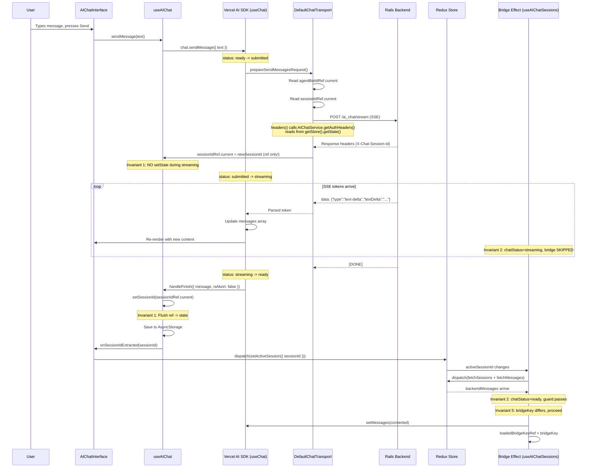

# AI Chat Architecture

> Canonical reference for the AI chat feature in chatwoot-mobile-app.
> Covers streaming lifecycle, state management, safety invariants, and component structure.

---

## 1. Architecture Overview

### 1.1 Pattern

The AI chat module follows the app's standard Redux pattern:

```
Service -> Actions -> Slice -> Selectors
```

All files live under `src/store/ai-chat/` with Zod schemas as the single source of truth
for API response types. The Vercel AI SDK v5 (`@ai-sdk/react` `useChat`) handles streaming
via `DefaultChatTransport` + `expo/fetch`.

### 1.2 What It Replaced

This architecture replaced an 85-file Clean Architecture + DI approach spanning:

- 7 domain entities/value-objects
- 6 application use cases
- 12 infrastructure repositories/services/mappers
- 5 DI module registrations
- 14 test files

The simplification was executed in 6 implementation cycles (documented in
`docs/temp/ai-chat-simplification/implementation-cycles.md`). The Python AI backend was
eliminated; all API calls now go through Rails exclusively.

### 1.3 Dependency Chain

```
Layer 0: CONSTANTS + SHARED UI TYPES (no deps)
  src/types/ai-chat/constants.ts
  src/types/ai-chat/parts.ts

Layer 1: SCHEMAS (depends on: zod)
  src/store/ai-chat/aiChatSchemas.ts

Layer 2: TYPES (depends on: schemas)
  src/store/ai-chat/aiChatTypes.ts

Layer 3: MAPPER (depends on: types, constants)
  src/store/ai-chat/aiChatMapper.ts

Layer 4: SERVICE (depends on: types, apiService, storeAccessor)
  src/store/ai-chat/aiChatService.ts

Layer 5: STORE (depends on: types, service, mapper)
  src/store/ai-chat/aiChatActions.ts
  src/store/ai-chat/aiChatSlice.ts
  src/store/ai-chat/aiChatSelectors.ts

Layer 6: HOOKS (depends on: types, store, Vercel AI SDK)
  src/presentation/hooks/ai-assistant/useAIChat.ts
  src/presentation/hooks/ai-assistant/useAIChatSessions.ts
  src/presentation/hooks/ai-assistant/useAIChatBot.ts
  src/presentation/hooks/ai-assistant/useAIChatScroll.ts

Layer 7: UI COMPONENTS (depends on: hooks, types/ai-chat/)
  src/presentation/containers/ai-assistant/
  src/presentation/components/ai-assistant/
  src/presentation/parts/ai-assistant/
```

Each layer only imports from layers above it. No circular or upward imports.

---

## 2. The 5 Streaming Safety Invariants

These invariants prevent the "streaming cascade bug" -- a runaway re-render loop where
`setMessages` triggers re-renders that fire effects that call `setMessages` again, producing
a "Maximum update depth exceeded" error or corrupted streaming output. Breaking any single
invariant reintroduces the bug.

### Invariant 1: Session ID Ref-Then-State Deferral

**What it prevents:** Mid-stream re-renders caused by session ID state updates that trigger
Redux dispatches, message fetches, and bridge effects while SSE tokens are still arriving.

**Where it lives:**

- Ref-only write during streaming:
  `src/presentation/hooks/ai-assistant/useAIChat.ts:233-235`
  ```typescript
  const newSessionId = response.headers.get('X-Chat-Session-Id');
  if (newSessionId && newSessionId !== sessionIdRef.current) {
    sessionIdRef.current = newSessionId; // update ref only, no re-render during streaming
  }
  ```

- Flush ref to state after streaming completes:
  `src/presentation/hooks/ai-assistant/useAIChat.ts:316-329`
  ```typescript
  const handleFinish = useCallback(
    ({ message, isAbort }: { message: UIMessage; isAbort: boolean }) => {
      if (isMountedRef.current) {
        if (!isAbort) {
          const pendingSessionId = sessionIdRef.current;
          if (pendingSessionId) {
            setSessionId(pendingSessionId);
          }
        }
        optionsRef.current?.onFinish?.(message);
      }
    },
    [], // MUST be empty deps
  );
  ```

**How it works:** The `X-Chat-Session-Id` header arrives with the first SSE response chunk.
During streaming, the ID is stored in `sessionIdRef` (a React ref -- no re-render). Only in
`handleFinish`, after the SDK status returns to `ready`, is the ref flushed to React state
via `setSessionId()`. This state change triggers the save effect which calls
`onSessionIdExtracted` -> Redux dispatch -> `fetchMessages` -> bridge effect, but by then
streaming is complete and the bridge guard (Invariant 2) allows loading.

**What breaks if removed:** `setSessionId` during streaming -> save effect fires ->
`onSessionIdExtracted` dispatches to Redux -> `fetchMessages` returns -> bridge effect calls
`setMessages` with backend data -> overwrites in-flight streaming content -> SDK re-renders
-> cascade.

---

### Invariant 2: Bridge Effect Streaming Guard

**What it prevents:** The reactive bridge (which loads persisted messages from Redux into the
SDK) from overwriting in-flight streaming content with stale backend data.

**Where it lives:**
`src/presentation/hooks/ai-assistant/useAIChatSessions.ts:161-162`
```typescript
chatStatus !== 'streaming' &&
chatStatus !== 'submitted'
```

This guard is part of a larger condition block at lines 155-163:
```typescript
if (
  activeSessionId &&
  !isLoadingMessages &&
  backendMessages.length > 0 &&
  setMessagesRef.current &&
  !isNewConversationRef.current &&
  chatStatus !== 'streaming' &&
  chatStatus !== 'submitted'
) {
```

**How it works:** The `chatStatus` parameter is passed from `AIChatInterface.tsx:183` where
it receives the SDK's `status` field. During streaming, status is `'submitted'` or
`'streaming'`. The bridge effect skips entirely when either status is active, ensuring the
SDK retains exclusive ownership of message state during streaming.

**What breaks if removed:** Backend `fetchMessages` may complete while streaming is active.
Without the guard, the bridge calls `setMessages()` with stale persisted data, erasing the
partially-streamed assistant response. The SDK detects the change, re-renders, and the
cycle repeats.

---

### Invariant 3: Stable SDK Callback References (optionsRef Pattern)

**What it prevents:** The Vercel AI SDK's `Chat` class from being re-instantiated or
capturing permanently stale closures for `onFinish` and `onError`.

**Where it lives:**

- Ref declaration and sync:
  `src/presentation/hooks/ai-assistant/useAIChat.ts:155-161`
  ```typescript
  const optionsRef = useRef(options);
  // ...
  useEffect(() => {
    optionsRef.current = options;
  }, [options]);
  ```

- Stable `handleFinish` with empty deps:
  `src/presentation/hooks/ai-assistant/useAIChat.ts:316-336`
  ```typescript
  const handleFinish = useCallback(
    ({ message, isAbort }: { message: UIMessage; isAbort: boolean }) => {
      // reads from refs only -- never stale
      optionsRef.current?.onFinish?.(message);
    },
    [], // MUST be empty deps
  );
  ```

- Stable `handleError` with empty deps:
  `src/presentation/hooks/ai-assistant/useAIChat.ts:296-314`
  ```typescript
  const handleError = useCallback(
    (error: Error) => {
      // ...
      optionsRef.current?.onError?.(error);
    },
    [], // Empty deps -- reads from refs only
  );
  ```

**How it works:** The SDK's `useChat` hook creates a `Chat` instance via `useRef` internally.
The `onFinish` and `onError` callbacks are captured at construction time and never updated.
By using `useCallback(fn, [])` with empty dependency arrays, the callback references are
stable across renders. Inside the callbacks, dynamic values are read from refs
(`optionsRef.current`, `sessionIdRef.current`, `isMountedRef.current`) which always hold
current values without triggering re-renders.

**What breaks if removed:** If `handleFinish` had deps (e.g. `[sessionId]`), its reference
would change on every session update. But the SDK ignores reference changes after
construction -- it would keep calling the original stale closure, reading an outdated
`sessionId`. Alternatively, if the SDK did react to reference changes, it would recreate
the Chat instance mid-stream, aborting the active SSE connection.

---

### Invariant 4: Transport useMemo Non-Reactive Dependencies

**What it prevents:** The SSE transport from being torn down and recreated during streaming
because a reactive selector value changed.

**Where it lives:**
`src/presentation/hooks/ai-assistant/useAIChat.ts:213-285`
```typescript
const transport = useMemo(() => {
  const apiEndpoint = AIChatService.getStreamEndpoint();
  return new DefaultChatTransport({
    api: apiEndpoint,
    fetch: async (url, fetchOptions) => { /* ... */ },
    headers: () => ({
      ...AIChatService.getAuthHeaders(),
      'Content-Type': 'application/json',
      Accept: 'text/event-stream',
    }),
    prepareSendMessagesRequest: async options => { /* ... */ },
  });
  // eslint-disable-next-line react-hooks/exhaustive-deps
}, [agentBotId]); // ONLY agentBotId -- no config, no aiBackendUrl
```

**How it works:** The `useMemo` dependency array contains only `[agentBotId]`. Auth headers
and the stream endpoint URL are read imperatively inside callbacks via
`AIChatService.getAuthHeaders()` and `AIChatService.getStreamEndpoint()`, which call
`getStore().getState()` internally. This means auth token rotation does not cause transport
recreation. The `agentBotIdRef` pattern (line 156, 259) ensures `prepareSendMessagesRequest`
always reads the latest bot ID without adding it as a reactive dependency.

**What breaks if removed:** Adding reactive values (e.g. auth headers from selectors, config
objects) to the `useMemo` deps would cause the transport to be recreated whenever those
values change. If auth headers rotate during streaming (e.g. DeviseTokenAuth returns new
tokens in response headers), the transport is destroyed, the SSE connection drops, and the
streaming response is lost.

---

### Invariant 5: loadedBridgeKeyRef Fingerprint Dedup

**What it prevents:** Infinite render loops where `setMessages()` triggers a re-render that
causes the bridge effect to fire again with identical data.

**Where it lives:**
`src/presentation/hooks/ai-assistant/useAIChatSessions.ts:166-177`
```typescript
const firstId = backendMessages[0]?.id ?? '';
const lastId = backendMessages[backendMessages.length - 1]?.id ?? '';
const bridgeKey = `${activeSessionId}:${backendMessages.length}:${firstId}:${lastId}`;

if (loadedBridgeKeyRef.current === bridgeKey) {
  // Already loaded this exact set of messages -- skip to prevent re-render loop
  return;
}

const converted = mapMessagesToUIMessages(backendMessages);
setMessagesRef.current(converted);
loadedBridgeKeyRef.current = bridgeKey;
```

The ref is declared at line 89:
```typescript
const loadedBridgeKeyRef = useRef<string | null>(null);
```

And reset on session switch at line 189:
```typescript
loadedBridgeKeyRef.current = null; // Reset so bridge loads new session's messages
```

**How it works:** A string fingerprint is computed from `sessionId:messageCount:firstId:lastId`.
Before calling `setMessages()`, the effect checks if this fingerprint matches the last
loaded fingerprint. If it matches, the effect returns early. If it differs (new messages or
new session), `setMessages()` is called and the fingerprint is updated.

**What breaks if removed:** Redux selectors with `createSelector` can return new array
references even when the underlying data is identical (cache miss). Without the fingerprint
guard: selector returns new ref -> effect fires -> `setMessages()` -> SDK re-renders ->
selector re-evaluates (potentially new ref again) -> effect fires -> infinite loop.

---

## 3. Streaming Lifecycle

### 3.1 Step-by-Step Flow



### 3.2 Status Transitions

The SDK `status` field transitions through these states:

```
ready -> submitted -> streaming -> ready
                  \-> error (on failure)
```

| Status | Meaning | Bridge allowed? |
|--------|---------|-----------------|
| `ready` | Idle, no active stream | Yes |
| `submitted` | Request sent, waiting for first byte | No |
| `streaming` | SSE tokens arriving | No |
| `error` | Stream failed | Yes |

### 3.3 Session ID Timing

1. **First message in new conversation:** No `chat_session_id` in request body.
   Rails creates a session and returns `X-Chat-Session-Id` in response headers.
2. **Subsequent messages:** `sessionIdRef.current` is included in the request body
   as `chat_session_id` (line 277-279 of `useAIChat.ts`).
3. **Session switch:** `handleSelectSession` calls `stop()`, clears messages, dispatches
   `setActiveSession`, and resets `loadedBridgeKeyRef`.

---

## 4. State Management

### 4.1 Redux Store Structure

```typescript
// src/store/ai-chat/aiChatTypes.ts
interface AIChatState {
  sessions: Record<string, AIChatSession[]>;  // keyed by "agentBot_{id}"
  messages: Record<string, AIChatMessage[]>;  // keyed by session ID
  isLoadingSessions: boolean;
  isLoadingMessages: boolean;
  sessionsError: string | null;
  messagesError: string | null;
  activeSessionId: string | null;
}
```

### 4.2 What Lives Where

| Concern | Location | Why |
|---------|----------|-----|
| Session list | Redux (`state.aiChat.sessions`) | Persisted, shared across components |
| Persisted messages | Redux (`state.aiChat.messages`) | Backend data, survives session switch |
| Streaming messages | SDK (`chat.messages`) | Owned by Vercel AI SDK during streaming |
| Active session ID | Redux (`state.aiChat.activeSessionId`) | Drives fetches + bridge |
| Current session ID (during stream) | `sessionIdRef` in useAIChat | Deferred to avoid mid-stream renders |
| Chat status | SDK (`chat.status`) | Drives bridge guard + UI indicators |
| Bot data | Local state in useAIChatBot | Fetched once on mount |
| Scroll position | Refs in useAIChatScroll | Performance -- no re-renders |

### 4.3 Message Merge (Bridge Effect)

The bridge effect in `useAIChatSessions.ts:147-179` merges persisted backend messages into
the SDK's message state. It runs when:

1. `activeSessionId` is set
2. `isLoadingMessages` is false (fetch completed)
3. `backendMessages.length > 0`
4. `chatStatus` is not `streaming` or `submitted` (Invariant 2)
5. `isNewConversationRef.current` is false
6. `loadedBridgeKeyRef` fingerprint differs (Invariant 5)

The conversion uses `mapMessagesToUIMessages()` from `src/store/ai-chat/aiChatMapper.ts`
which maps backend DTOs to SDK `UIMessage` format, preserving tool calls (as `dynamic-tool`
parts) and reasoning parts.

### 4.4 Selector Memoization

All selectors in `src/store/ai-chat/aiChatSelectors.ts` use `createSelector` from
`@reduxjs/toolkit`. Stable empty array references prevent unnecessary re-renders:

```typescript
// src/store/ai-chat/aiChatSelectors.ts:11-12
const EMPTY_SESSIONS: AIChatSession[] = [];
const EMPTY_MESSAGES: AIChatMessage[] = [];
```

Key selectors:

| Selector | Input | Output |
|----------|-------|--------|
| `selectSessionsByAgentBot` | `(state, agentBotId)` | `AIChatSession[]` |
| `selectMessagesBySession` | `(state, sessionId)` | `AIChatMessage[]` |
| `selectActiveSessionId` | `(state)` | `string \| null` |
| `selectIsLoadingMessages` | `(state)` | `boolean` |

---

## 5. Session Management

### 5.1 Session Lifecycle

**On mount (`useAIChatSessions`):**
1. `useAIChatBot` fetches available bots from `/ai_chat/bots`
2. `useAIChatSessions` dispatches `fetchSessions({ agentBotId, limit: 25 })`
3. Auto-select effect picks the latest session (first in sorted list) if no
   `activeSessionId` is set and `isNewConversationRef.current` is false (line 92-103)
4. `fetchMessages` is dispatched for the active session (line 126-135)
5. Bridge effect loads messages into SDK (guarded by Invariants 2 and 5)

**Session persistence (`useAIChat`):**
- On mount: loads from `AsyncStorage` key `@ai_chat_active_session` (line 176-192)
- On change: saves to `AsyncStorage` then calls `onSessionIdExtracted` (line 195-207)

### 5.2 The isNewConversationRef Flag

Declared at `useAIChatSessions.ts:66`:
```typescript
const isNewConversationRef = useRef(false);
```

**Lifecycle:**
- Set `true` in `handleNewConversation()` (line 204)
- Set `false` in `handleSelectSession()` (line 188)
- Set `false` when `activeSessionId` becomes truthy (line 107-111)

**Purpose:** Prevents auto-select from immediately re-selecting the latest session after the
user presses "New Conversation" (which sets `activeSessionId` to null). Also prevents the
bridge from loading old messages into a fresh SDK state.

### 5.3 handleSelectSession Flow

`src/presentation/hooks/ai-assistant/useAIChatSessions.ts:182-200`

1. Early return if selecting the already-active session
2. Set `isNewConversationRef = false`
3. Reset `loadedBridgeKeyRef = null` (allows bridge to load new session's messages)
4. Call `stop()` to cancel any active stream
5. Call `setMessages([])` to clear SDK state
6. Dispatch `setActiveSession({ sessionId })` to Redux
7. Close sessions panel

### 5.4 handleNewConversation Flow

`src/presentation/hooks/ai-assistant/useAIChatSessions.ts:203-214`

1. Set `isNewConversationRef = true`
2. Reset `loadedBridgeKeyRef = null`
3. Call `stop()` to cancel any active stream
4. Dispatch `setActiveSession({ sessionId: null })` to Redux
5. Call `clearSession()` which removes AsyncStorage key and calls `setMessages([])`

---

## 6. Component Hierarchy

```
ConversationScreen
  FloatingAIAssistant (FAB + expanded overlay)
    AIChatInterface (container, orchestrates all hooks)
      AIChatHeader (status indicator, session toggle, new conversation)
      AIChatMessagesView (inner memo'd component)
        AIChatMessagesList (FlashList, scroll buttons, typing indicator)
          AIMessageBubble (avatar + bubble layout per message)
            AIPartRenderer (dispatch to part component)
              AITextPart (markdown + streaming cursor)
              AIToolPart (collapsible tool invocation)
              AIReasoningPart (collapsible reasoning)
      AIInputField (text input + send/cancel button)
      AIChatSessionPanel (BottomSheet with session list)
```

### 6.1 FloatingAIAssistant

`src/presentation/containers/ai-assistant/FloatingAIAssistant.tsx`

- Renders as a FAB (floating action button) when collapsed
- Expands to full-screen overlay with `AIChatInterface`
- Uses Reanimated shared values for spring/timing animations
- Memoized with custom comparison on `agentBotId`
- Receives `agentBotId` prop from ConversationScreen

### 6.2 AIChatInterface

`src/presentation/containers/ai-assistant/AIChatInterface.tsx`

The orchestrator. Hooks consumed:
- `useAIChatBot(agentBotId, accountId)` -- bot selection
- `useAIChat({ agentBotId, chatSessionId, onSessionIdExtracted })` -- streaming
- `useAIChatSessions(botId, accountId, agentBotId, setMessages, clearSession, cancel, status)` -- session management

Key responsibility: passes `status` to `useAIChatSessions` so the bridge guard
(Invariant 2) can check streaming state.

The component splits message rendering into `AIChatMessagesView` (inner memo'd component)
to isolate scroll management from session management re-renders.

### 6.3 AIChatMessagesList

`src/presentation/components/ai-assistant/AIChatMessagesList.tsx`

- Uses `@shopify/flash-list` via `Animated.createAnimatedComponent(FlashList)`
- `estimatedItemSize`: 300 (tuned for typical message height)
- `extraData`: `"${listData.length}-${isLoading}"` for change detection
- Renders typing indicator (3 animated dots) when `status === 'submitted'`
- Floating scroll-to-bottom/top buttons based on scroll position
- Error display via `AIChatError` component

### 6.4 AIMessageBubble

`src/presentation/components/ai-assistant/AIMessageBubble.tsx`

Splits message parts by category (assistant messages only):
- **Reasoning parts** -> rendered outside the bubble (collapsible)
- **Tool parts** -> rendered outside the bubble (deduplicated by `toolCallId`)
- **Text parts** -> rendered inside the bubble (with markdown)

User messages render all parts inside the bubble as plain text.

### 6.5 Part Renderers

`src/presentation/parts/ai-assistant/`

| Component | File | Renders |
|-----------|------|---------|
| `AITextPart` | `AITextPart.tsx` | Markdown text + blinking cursor during streaming |
| `AIToolPart` | `AIToolPart.tsx` | Tool invocation with input/output in collapsible |
| `AIReasoningPart` | `AIReasoningPart.tsx` | Reasoning/thinking in collapsible with markdown |
| `AIPartRenderer` | `AIPartRenderer.tsx` | Dispatcher: routes parts to correct renderer |
| `AICollapsible` | `AICollapsible.tsx` | Animated expand/collapse wrapper |

---

## 7. Auth and Transport

### 7.1 DeviseTokenAuth Headers

The Chatwoot Rails backend uses DeviseTokenAuth, which requires three headers:

```
access-token: <token>
uid: <user-email>
client: <client-id>
```

### 7.2 Two Auth Paths

**Regular API calls** (fetchBots, fetchSessions, fetchMessages, deleteSession):
Use `apiService` from `src/services/APIService.ts`, which attaches auth headers
automatically via Axios request interceptors. The `AIChatService` static methods
(`src/store/ai-chat/aiChatService.ts:29-74`) use this path.

**Streaming transport** (SSE connection):
Uses `expo/fetch` directly (not Axios). Auth headers must be provided explicitly.
`AIChatService.getAuthHeaders()` (`src/store/ai-chat/aiChatService.ts:100-113`) reads
from the Redux store imperatively:

```typescript
static getAuthHeaders(): Record<string, string> {
  const state = getStore().getState();
  const headers = state.auth?.headers;
  if (!headers) return {};
  return {
    'access-token': headers['access-token'] ?? '',
    uid: headers.uid ?? '',
    client: headers.client ?? '',
  };
}
```

### 7.3 The getStore() Pattern

`getStore()` from `src/store/storeAccessor.ts` provides imperative (non-reactive) access
to Redux state. This is critical for Invariant 4 -- reading auth headers and the stream
endpoint inside transport callbacks avoids adding reactive selector values to the
`useMemo` dependency array.

The transport's `headers` callback is invoked per-request by `DefaultChatTransport`,
ensuring fresh auth tokens without transport recreation:

```typescript
headers: () => ({
  ...AIChatService.getAuthHeaders(),  // reads from store at call time
  'Content-Type': 'application/json',
  Accept: 'text/event-stream',
}),
```

---

## 8. Error Handling

### 8.1 Error Categorization

The `AIChatError` component (`src/presentation/components/ai-assistant/AIChatError.tsx`)
categorizes errors for appropriate user messaging:

| Category | Detection | User action |
|----------|-----------|-------------|
| Network | Message contains "network", "fetch", "timeout" | Retry |
| Auth | HTTP 401/403, message contains "unauthorized" | Re-authenticate |
| Server | HTTP 5xx, message contains "server" | Retry later |
| Unknown | Everything else | Retry or fresh start |

### 8.2 Error Flow

1. Transport `fetch` callback checks `response.ok` and parses Chatwoot error fields
   (`error_details`, `error`, `message`) at `useAIChat.ts:86-100`
2. SDK receives the thrown error and calls `handleError`
3. `handleError` (Invariant 3) filters known SDK internal errors (e.g. "Cannot read
   property 'text' of undefined") and forwards the rest to `optionsRef.current.onError`
4. `AIChatInterface` tracks error state via `chat.error` and implements error dismissal
   via `dismissedError` state (lines 160-166)

### 8.3 clearErrorOnSend Pattern

When the user sends a new message, the SDK automatically clears `chat.error` (the error
is part of SDK internal state). The `dismissedError` state in `AIChatInterface` is
separate -- it tracks which error message the user explicitly dismissed so it does not
re-appear until a new, different error occurs.

---

## 9. Known Constraints and Gotchas

### 9.1 web-streams-polyfill Version Mismatch

The Vercel AI SDK requires `web-streams-polyfill` but conflicts with the version bundled
by other dependencies. A pnpm override in `package.json` forces a compatible version.
Removing this override can cause streaming to silently fail.

### 9.2 i18n-js v3.8 Variable Syntax

The app uses `i18n-js` v3.8 which uses `%{variable}` interpolation syntax, not
`{variable}`. Example:

```javascript
// Correct
i18n.t('AI_ASSISTANT.CHAT.MESSAGES.ERROR_RENDERING', { id: item.id })
// In locale file: "Error rendering message %{id}"
```

### 9.3 FlashList estimatedItemSize

The `estimatedItemSize` is set to 300 at `AIChatMessagesList.tsx:183`. This affects
FlashList's recycling performance. Too small causes excessive re-layouts during streaming;
too large wastes memory. The value was tuned empirically for typical AI chat messages
(markdown text + occasional tool/reasoning parts).

### 9.4 Keyboard Avoiding Behavior

`AIChatInterface.tsx:220-223` uses `react-native-keyboard-controller`:

```typescript
<KeyboardAvoidingView
  style={tailwind.style('flex-1')}
  behavior={Platform.OS === 'ios' ? 'padding' : 'height'}
  keyboardVerticalOffset={insets.top}>
```

iOS uses `padding` behavior (adds padding at the bottom). Android uses `height` behavior
(resizes the view). The `keyboardVerticalOffset` accounts for the safe area inset at
the top. Using the wrong behavior on either platform causes the input field to be
obscured by the keyboard or to jump erratically.

### 9.5 Stable Ref Patterns in useAIChatSessions

Functions received from the parent (`setMessages`, `clearSession`, `stop`) are stored in
refs at `useAIChatSessions.ts:71-83` to prevent cascade re-renders during streaming.
The parent re-renders on every streaming tick (due to `chat.messages` updates), and
without refs, these function references would appear as changed dependencies, causing
effects to re-fire.

### 9.6 AppState Handling

When the app goes to background during streaming (`useAIChat.ts:349-363`), the stream is
cancelled via `chat.stop()`. This prevents battery drain from an idle SSE connection.
The stream is NOT automatically resumed on foreground -- the user must send a new message
or the bridge effect loads the last persisted state.

---

## Appendix: File Reference

| File | Lines | Purpose |
|------|-------|---------|
| `src/types/ai-chat/constants.ts` | 88 | PART_TYPES, TOOL_STATES, CHAT_STATUS, MESSAGE_ROLES |
| `src/types/ai-chat/parts.ts` | 286 | Type guards, part types, utilities |
| `src/store/ai-chat/aiChatSchemas.ts` | 79 | Zod schemas, inferred types, parse functions |
| `src/store/ai-chat/aiChatTypes.ts` | 64 | Redux state shape, payload types |
| `src/store/ai-chat/aiChatMapper.ts` | 129 | Backend DTO -> UIMessage mapper |
| `src/store/ai-chat/aiChatService.ts` | 114 | Static API service (Rails-only) |
| `src/store/ai-chat/aiChatActions.ts` | 78 | Async thunks with error handling |
| `src/store/ai-chat/aiChatSlice.ts` | 139 | Redux slice with sync + async reducers |
| `src/store/ai-chat/aiChatSelectors.ts` | 108 | Memoized selectors |
| `src/presentation/hooks/ai-assistant/useAIChat.ts` | 432 | Core hook: SDK + transport + session persistence |
| `src/presentation/hooks/ai-assistant/useAIChatSessions.ts` | 225 | Session mgmt + reactive bridge |
| `src/presentation/hooks/ai-assistant/useAIChatBot.ts` | 66 | Bot selection |
| `src/presentation/hooks/ai-assistant/useAIChatScroll.ts` | 280 | Scroll management |
| `src/presentation/containers/ai-assistant/FloatingAIAssistant.tsx` | 150 | FAB + overlay |
| `src/presentation/containers/ai-assistant/AIChatInterface.tsx` | 276 | Container orchestrator |
| `src/presentation/components/ai-assistant/AIChatMessagesList.tsx` | 277 | FlashList message list |
| `src/presentation/components/ai-assistant/AIMessageBubble.tsx` | 208 | Message bubble layout |
| `src/presentation/parts/ai-assistant/AITextPart.tsx` | 238 | Markdown text + cursor |
