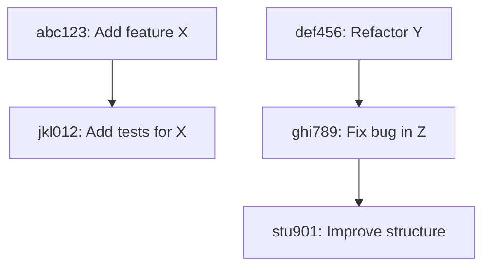
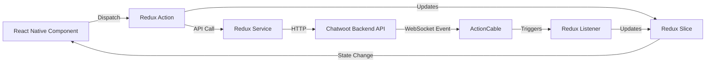

# Code Review - Commit Analysis
## [Branch Name]

**IMPORTANT**: This document MUST be created in `/docs/ignored/code_review/<branch_name>_commit_analysis.md`

**Review ID**: <unique_id>
**Branch**: `<branch_name>`
**Base Branch**: `development` | `main`
**Created**: YYYY-MM-DD HH:MM:SS
**Reviewer**: [Name/Agent]
**Status**: Draft | In Progress | Complete

> **Note on Diagrams**: When including diagrams in this commit analysis, use simple mermaid snippets to visualize commit relationships, affected components, and change flows.

---

## Branch Information

### Branch Metadata
- **Branch Name**: `<branch_name>`
- **Total Commits**: X commits
- **Date Range**: YYYY-MM-DD to YYYY-MM-DD
- **Author(s)**: [List of authors]
- **Files Changed**: X files
- **Lines Changed**: +XXX / -XXX

### Git Commands Used
```bash
# Commit history
git log --oneline --graph development..HEAD

# File changes
git diff --stat development...HEAD

# Detailed diff
git diff --name-status development...HEAD
```

---

## Commit Summary

### Commit List

| # | SHA | Type | Message | Files | +/- |
|---|-----|------|---------|-------|-----|
| 1 | `abc123` | feat | Add new feature X | 5 | +120/-10 |
| 2 | `def456` | refactor | Refactor component Y | 3 | +50/-80 |
| 3 | `ghi789` | fix | Fix bug in Z | 2 | +15/-5 |
| 4 | `jkl012` | test | Add tests for X | 2 | +200/-0 |
| 5 | `mno345` | docs | Update documentation | 1 | +50/-20 |

**Total**: X commits

---

### Commits by Category

**Features** (X commits):
- `abc123` - Add new feature X
- `pqr678` - Implement feature Y

**Refactorings** (X commits):
- `def456` - Refactor component Y
- `stu901` - Improve code structure in Z

**Bug Fixes** (X commits):
- `ghi789` - Fix bug in Z
- `vwx234` - Resolve issue with A

**Tests** (X commits):
- `jkl012` - Add tests for X
- `yza567` - Update test coverage for Y

**Documentation** (X commits):
- `mno345` - Update documentation
- `bcd890` - Add inline comments

**Other** (X commits):
- `efg123` - Miscellaneous changes

---

### Commit Relationships

**Dependency Chain** (optional - use mermaid for clarity):


**Description**:
- Commits A and B are related: Feature implementation + tests
- Commits C, D, E form a refactoring sequence

---

## Affected Components

### By Layer

**Backend - Models** (X files, +A/-B lines):
- `app/models/model1.rb` - [Change description]
- `app/models/model2.rb` - [Change description]
- `app/models/concerns/concern1.rb` - [Change description]

**Backend - Services** (X files, +A/-B lines):
- `app/services/domain/action_service.rb` - [Change description]
- `app/services/domain/update_service.rb` - [Change description]

**Backend - Controllers** (X files, +A/-B lines):
- `app/controllers/api/v1/accounts/resource_controller.rb` - [Change description]
- `app/controllers/public/resource_controller.rb` - [Change description]

**Backend - Jobs** (X files, +A/-B lines):
- `app/jobs/domain/action_job.rb` - [Change description]

**Redux - Listeners** (X files, +A/-B lines):
- `src/store/resource/resourceListener.ts` - [Change description]

**Redux - Selectors** (X files, +A/-B lines):
- `src/store/resource/resourceSelectors.ts` - [Change description]

**React Native - Components** (X files, +A/-B lines):
- `src/components-next/ComponentName/ComponentName.tsx` - [Change description]

**React Native - Screens** (X files, +A/-B lines):
- `src/screens/resource/ScreenName.tsx` - [Change description]

**Navigation** (X files, +A/-B lines):
- `src/navigation/stack/ResourceNavigator.tsx` - [Change description]

**Hooks** (X files, +A/-B lines):
- `src/hooks/useResource.ts` - [Change description]

**Utils** (X files, +A/-B lines):
- `src/utils/resourceUtils.ts` - [Change description]

**i18n** (X files, +A/-B lines):
- `src/i18n/en.json` - [Change description]
- `src/i18n/es.json` - [Change description]

**Redux Tests** (X files, +A/-B lines):
- `src/store/resource/specs/resourceSlice.spec.ts` - [Change description]
- `src/store/resource/specs/resourceActions.spec.ts` - [Change description]
- `src/store/resource/specs/resourceService.spec.ts` - [Change description]

**Component Tests** (X files, +A/-B lines):
- `src/components-next/ComponentName/specs/ComponentName.spec.tsx` - [Change description]

**Documentation** (X files, +A/-B lines):
- `docs/some_doc.md` - [Change description]

**Configuration** (X files, +A/-B lines):
- `package.json` - [Change description]
- `app.config.ts` - [Change description]

---

### Component Diagram (optional)



---

### Files by Type

**Redux State Management** (X files):
- Slice files: X
- Action files: X
- Service files: X
- Selector files: X
- Listener files: X
- Type files: X
- Jest test files: X
- Other: X

**UI Components** (X files):
- React Native components: X
- Screen files: X
- Navigation files: X
- Hook files: X
- Util files: X
- Jest test files: X
- Other: X

**Database Files** (X files):
- Migrations: X
- Schema updates: X

**i18n Files** (X files):
- Backend (YML): X
- Frontend (JSON): X

**Configuration Files** (X files):
- Gemfile: X
- package.json: X
- Other config: X

**Documentation Files** (X files):
- Markdown: X
- Other: X

---

## Change Patterns

### Common Patterns Identified

**Pattern 1: Full-Stack Field Addition**
- **Files Involved**:
  - Model: `model1.rb`
  - Migration: `YYYYMMDDHHMMSS_add_field_to_table.rb`
  - Service: `service1.rb`
  - Controller: `controller1.rb`
  - Jbuilder: `show.json.jbuilder`
  - Vue Component: `ComponentName.vue`
  - Vuex Store: `stores.js`
  - i18n: `en.json`, `es.json`
- **Change Type**: Added new field `field_name`
- **Completeness**: ✅ Complete | ⚠️ Potential Gap | ❌ Missing changes
- **Notes**: [Any observations]

**Pattern 2: Feature Addition**
- **Files Involved**: [List]
- **Change Type**: [Description]
- **Completeness**: ✅ | ⚠️ | ❌
- **Notes**: [Any observations]

**Pattern 3: Refactoring**
- **Files Involved**: [List]
- **Change Type**: [Description]
- **Completeness**: ✅ | ⚠️ | ❌
- **Notes**: [Any observations]

---

### Change Relationships

**Related Changes**:
1. Model `Store` modified → Migration created → Service updated → Controller updated → Jbuilder view updated → Vue component updated → Tests added
2. New endpoint added → Controller action → Service object → Event dispatched → Listener triggered → Job enqueued → Tests added
3. [Other relationship]

**Isolated Changes**:
1. Documentation update (no code impact)
2. Test-only change (no production code)
3. [Other isolated change]

---

## Areas for Review

### Priority 1: Critical Areas

**Area 1: [Component/Feature Name]**
- **Why Critical**: [Reason - e.g., affects core business logic, breaking change, security impact]
- **Files to Review**:
  - `file1.py`
  - `file2.py`
- **Focus Points**:
  - Validation logic
  - Error handling
  - Backward compatibility
- **Estimated Review Time**: X minutes

**Area 2: [Component/Feature Name]**
- **Why Critical**: [Reason]
- **Files to Review**: [List]
- **Focus Points**: [List]
- **Estimated Review Time**: X minutes

---

### Priority 2: Important Areas

**Area 1: [Component/Feature Name]**
- **Why Important**: [Reason - e.g., significant refactoring, new pattern introduced]
- **Files to Review**: [List]
- **Focus Points**: [List]
- **Estimated Review Time**: X minutes

**Area 2: [Component/Feature Name]**
- **Why Important**: [Reason]
- **Files to Review**: [List]
- **Focus Points**: [List]
- **Estimated Review Time**: X minutes

---

### Priority 3: Lower Priority Areas

**Area 1: [Component/Feature Name]**
- **Why Lower Priority**: [Reason - e.g., minor changes, documentation only]
- **Files to Review**: [List]
- **Focus Points**: [List]
- **Estimated Review Time**: X minutes

---

## Potential Issues Identified

### 🔴 Critical Concerns

**Concern 1: [Issue Title]**
- **Description**: [What looks wrong or suspicious]
- **Location**: `file.py:line_number`
- **Evidence**: [What you observed in the commits]
- **Impact**: [Potential consequences]
- **Requires Investigation**: Yes/No

**Concern 2: [Issue Title]**
- [Same structure]

---

### 🟡 Questions/Gaps

**Question 1: [What's unclear]**
- **Description**: [What needs clarification]
- **Location**: [Where this applies]
- **Why It Matters**: [Importance]

**Question 2: Missing Cross-Layer Change**
- **Description**: Entity modified but API schema not updated
- **Location**: Domain: `entity.py:50`, API: `schema.py` (not modified)
- **Why It Matters**: Could break API contracts
- **Requires Investigation**: Yes

---

### 💡 Observations

**Observation 1: [Pattern noticed]**
- **Description**: [What you noticed]
- **Location**: [Where]
- **Note**: [Why it's noteworthy]

---

## Review Strategy

### Recommended Review Order

1. **Models & Migrations** (X min)
   - Review model changes for correctness
   - Check validations, associations, scopes
   - Verify migrations exist and are reversible

2. **Services & Logic** (X min)
   - Review service object implementations
   - Check business logic correctness
   - Verify error handling and edge cases

3. **Controllers & Jbuilder** (X min)
   - Check controller actions and strong params
   - Verify Jbuilder views (camelCase)
   - Check HTTP status codes

4. **Jobs & Listeners** (X min)
   - Review event-driven logic
   - Check job implementations
   - Verify error handling and retries

5. **Frontend (Vue.js)** (X min)
   - Review Vue components (Composition API)
   - Check Vuex store changes
   - Verify Tailwind CSS usage (no custom CSS)
   - Check i18n (en.json + es.json)

6. **Tests** (X min)
   - Verify RSpec coverage (backend)
   - Check Vitest coverage (frontend)
   - Verify edge cases covered

7. **Cross-Component Validation** (X min)
   - Verify changes propagated across full stack
   - Check for missing migrations
   - Verify camelCase API responses
   - Check Enterprise compatibility

---

### Review Approach

**Deep Dive Areas**:
- [Area 1]: Read full implementation + tests
- [Area 2]: Verify pattern consistency
- [Area 3]: Check for security issues

**Quick Scan Areas**:
- [Area 1]: Documentation changes
- [Area 2]: Test-only changes
- [Area 3]: Minor refactorings

**Skip Areas** (if low risk):
- [Area 1]: Generated files
- [Area 2]: Whitespace-only changes

---

## Estimated Review Time

| Layer/Area | Estimated Time | Priority |
|------------|----------------|----------|
| Models & Migrations | X min | High |
| Services & Logic | X min | High |
| Controllers & Jbuilder | X min | High |
| Jobs & Listeners | X min | Medium |
| Frontend (Vue.js) | X min | High |
| Tests (RSpec + Vitest) | X min | Medium |
| Cross-Component Validation | X min | High |
| Documentation | X min | Low |
| **Total** | **XX min** | |

**Recommended Sessions**:
- Session 1 (45 min): Models + Migrations + Services
- Session 2 (40 min): Controllers + Jbuilder + Frontend
- Session 3 (30 min): Jobs + Listeners + Tests
- Session 4 (20 min): Cross-component validation + Enterprise

---

## Next Steps

1. ✅ Commit analysis complete
2. ⏭️ Create review plan: `/docs/ignored/code_review/<branch_name>_review_plan.md`
3. ⏭️ Execute detailed review (Phase 3)
4. ⏭️ Generate final report

---

## Appendix

### Git Log Output

```bash
# Full commit log
git log --oneline development..HEAD

[Paste output here]
```

---

### File Change Summary

```bash
# File changes
git diff --stat development...HEAD

[Paste output here]
```

---

### Search Queries Used

```bash
# Example searches performed
Glob: "app/models/**/*.rb"
Grep: "class.*ApplicationRecord"
Grep: "def perform"
Glob: "app/javascript/dashboard/components/**/*.vue"
Grep: "<script setup>"
```

---

**Last Updated**: YYYY-MM-DD HH:MM:SS
**Updated By**: [Reviewer Name/Agent]
