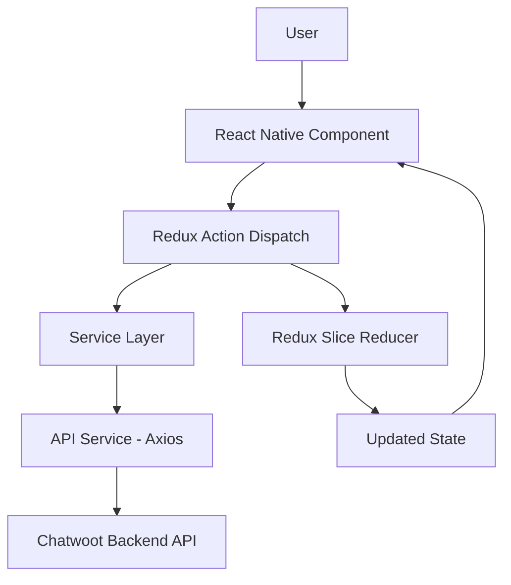
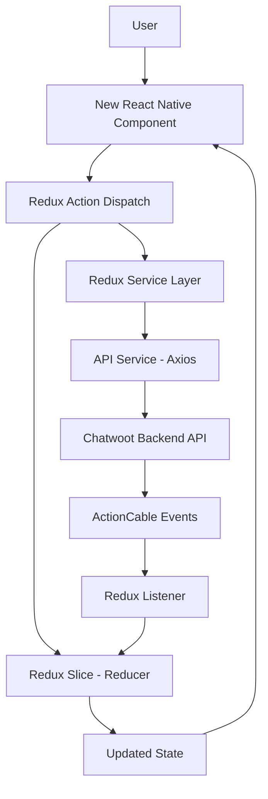

# [Feature Name] - Research Report

**IMPORTANT**: This document MUST be created in `/docs/ignored/design/<feature_name>_research.md`

**Session ID**: <unique_session_id>
**Created**: YYYY-MM-DD HH:MM:SS
**Research Agent**: Claude Code (Anthropic)
**Status**: Draft | Under Review | Approved
**Related Request**: <brief description of user request>
**Project**: Chatwoot Mobile App (React Native + Expo + TypeScript)

> **Note on Diagrams**: When including diagrams in this research report, use simple mermaid snippets to visualize architecture, flows, dependencies, and relationships. Keep diagrams minimal and focused on key concepts.

---

## Original Request

### User Request

> [Exact user request or summary]

### Request Date

YYYY-MM-DD HH:MM:SS

### Request Context

[Any additional context about why this request was made]

---

## Request Understanding

### Core Objective

[What the user wants to achieve - 2-3 sentences]

---

### Clarifications & Assumptions

#### Questions Asked

1. **Q**: [Question 1]
   **A**: [Answer 1]

2. **Q**: [Question 2]
   **A**: [Answer 2]

3. **Q**: [Question 3]
   **A**: [Answer 3]

#### Assumptions Made

1. [Assumption 1] - [Rationale]
2. [Assumption 2] - [Rationale]
3. [Assumption 3] - [Rationale]

---

### Success Criteria

- [ ] Criterion 1: [Description]
- [ ] Criterion 2: [Description]
- [ ] Criterion 3: [Description]
- [ ] Criterion 4: [Description]

---

## Repository Analysis

### Current Architecture

#### Files Analyzed

**Redux - Types** (X files):
- `src/store/[feature]/[feature]Types.ts:line_number` - [TypeScript interfaces and types]
- `src/types/[feature].ts:line_number` - [Shared type definitions]

**Redux - Slices** (X files):
- `src/store/[feature]/[feature]Slice.ts:line_number` - [State management, reducers]

**Redux - Actions** (X files):
- `src/store/[feature]/[feature]Actions.ts:line_number` - [Async actions, thunks]

**Redux - Services** (X files):
- `src/store/[feature]/[feature]Service.ts:line_number` - [API calls]

**Redux - Selectors** (X files):
- `src/store/[feature]/[feature]Selectors.ts:line_number` - [State selectors]

**Redux - Listeners** (X files):
- `src/store/[feature]/[feature]Listener.ts:line_number` - [Event-driven reactions]

**UI - Components** (X files):
- `src/components-next/ComponentName/ComponentName.tsx:line_number` - [Reusable UI components]

**UI - Screens** (X files):
- `src/screens/[feature]/ScreenName.tsx:line_number` - [Screen components]

**Hooks** (X files):
- `src/hooks/use[Feature].ts:line_number` - [Custom React hooks]

**Utils** (X files):
- `src/utils/[feature]Utils.ts:line_number` - [Pure utility functions]

**i18n** (X files):
- `src/i18n/en.json` - [English translations]
- `src/i18n/es.json` - [Spanish translations]

**Navigation** (X files):
- `src/navigation/stack/[Feature]Navigator.tsx` - [Stack navigation]

**Tests** (X files):
- `src/store/[feature]/specs/[feature]Slice.spec.ts:line_number` - [Redux tests]
- `src/screens/[feature]/specs/ScreenName.spec.tsx:line_number` - [Component tests]
- `src/hooks/specs/use[Feature].spec.ts:line_number` - [Hook tests]

**Total Files Analyzed**: XX files

---

### Current Implementation Patterns

#### Redux Patterns

**Redux Slices (createSlice)**:
```typescript
// src/store/conversation/conversationSlice.ts:15
import { createSlice } from '@reduxjs/toolkit';

const conversationSlice = createSlice({
  name: 'conversation',
  initialState: {
    conversations: [],
    loading: false,
    error: null,
  },
  reducers: {
    setConversations: (state, action) => {
      state.conversations = action.payload;
    },
  },
  extraReducers: (builder) => {
    // Handle async actions
  },
});

export default conversationSlice;
```

**Redux Actions (createAsyncThunk)**:
```typescript
// src/store/conversation/conversationActions.ts:10
import { createAsyncThunk } from '@reduxjs/toolkit';
import conversationService from './conversationService';

export const fetchConversations = createAsyncThunk(
  'conversation/fetchConversations',
  async (params, { rejectWithValue }) => {
    try {
      const response = await conversationService.fetchConversations(params);
      return response;
    } catch (error) {
      return rejectWithValue(error);
    }
  }
);
```

**Service Layer (API Calls)**:
```typescript
// src/store/conversation/conversationService.ts:5
import { apiService } from '@/services/APIService';
import camelCaseKeys from '@/utils/camelCaseKeys';

class ConversationService {
  static async fetchConversations(params) {
    const response = await apiService.get('/conversations', { params });
    return camelCaseKeys(response.data);
  }
}

export default ConversationService;
```

**Redux Listeners (createListenerMiddleware)**:
```typescript
// src/store/conversation/conversationListener.ts:8
import { createListenerMiddleware } from '@reduxjs/toolkit';

export const conversationListener = createListenerMiddleware();

conversationListener.startListening({
  actionCreator: fetchConversations.fulfilled,
  effect: (action, listenerApi) => {
    // Side effects, analytics, notifications
  },
});
```

#### UI Patterns

**React Native Components (Functional)**:
```typescript
// src/screens/conversations/ConversationList.tsx:10
import React from 'react';
import { View, Text } from 'react-native';
import { useAppSelector, useAppDispatch } from '@/store/hooks';
import { tailwind } from '@/theme/tailwind';

export const ConversationList = () => {
  const dispatch = useAppDispatch();
  const conversations = useAppSelector(state => state.conversation.conversations);

  return (
    <View style={tailwind('flex-1 bg-white')}>
      {/* Tailwind CSS only */}
    </View>
  );
};
```

**Redux Store Configuration**:
```typescript
// src/store/index.ts:20
import { configureStore } from '@reduxjs/toolkit';
import conversationSlice from './conversation/conversationSlice';
import { conversationListener } from './conversation/conversationListener';

export const store = configureStore({
  reducer: {
    conversation: conversationSlice.reducer,
    // ... other slices
  },
  middleware: (getDefaultMiddleware) =>
    getDefaultMiddleware().prepend(conversationListener.middleware),
});

export type RootState = ReturnType<typeof store.getState>;
export type AppDispatch = typeof store.dispatch;
```

---

### Dependencies & Relationships

**Key Dependencies**:
- Redux Slice → Redux Actions (async thunk creators)
- Redux Actions → Service Layer (API calls)
- Service Layer → APIService singleton (Axios)
- React Component → Redux Store (via hooks)
- Component → Navigation (React Navigation)

**Data Flow**:
```
User Action (React Component)
  ↓
Redux Action Dispatch (createAsyncThunk)
  ↓
Service Layer (API Call via Axios)
  ↓
Chatwoot Backend API (HTTP)
  ↓
camelCaseKeys Transformation
  ↓
Redux Slice Reducer (State Update)
  ↓
Component Re-render (via useAppSelector)
```

**Event Flow** (ActionCable):
```
Chatwoot Backend Event
  ↓
ActionCable WebSocket Connection
  ↓
Mobile ActionCable Client (src/utils/actionCable.ts)
  ↓
camelCaseKeys Transformation
  ↓
Redux Listener Middleware
  ↓
Redux Slice State Update
  ↓
Component Re-render
```

---

### Current Limitations

1. **Limitation 1**: [Description]
   - **Impact**: [How it affects users/system]
   - **Evidence**: [File reference or code example]

2. **Limitation 2**: [Description]
   - **Impact**: [How it affects users/system]
   - **Evidence**: [File reference or code example]

3. **Limitation 3**: [Description]
   - **Impact**: [How it affects users/system]
   - **Evidence**: [File reference or code example]

---

## Alternative Approaches

### Approach 1: [Name]

**Description**: [High-level description]

**Changes Required**:
- **Redux State**: Slices, Actions, Services, Selectors
- **UI Components**: Screens, Components, Navigation
- **Utilities**: Hooks, Utils, Helpers
- **Tests**: Jest specs (actions, slices, components)

**Pros**:
- Pro 1: [Description]
- Pro 2: [Description]
- Pro 3: [Description]

**Cons**:
- Con 1: [Description]
- Con 2: [Description]
- Con 3: [Description]

**Effort Estimate**: X days

**Risk Level**: Low | Medium | High

---

### Approach 2: [Name]

**Description**: [High-level description]

**Changes Required**:
- **Backend**: [Specific components]
- **Frontend**: [Specific components]
- **Database**: [Schema changes]
- **Tests**: [Test requirements]

**Pros**:
- Pro 1: [Description]
- Pro 2: [Description]

**Cons**:
- Con 1: [Description]
- Con 2: [Description]

**Effort Estimate**: Y days

**Risk Level**: Low | Medium | High

---

### Approach 3: [Name] (if applicable)

[Repeat structure from Approach 1]

---

## Recommendation

### Recommended Approach

**Choice**: Approach [X] - [Name]

**Rationale**:
1. [Reason 1]
2. [Reason 2]
3. [Reason 3]

**Trade-offs Accepted**:
- Trade-off 1: [Description and why it's acceptable]
- Trade-off 2: [Description and why it's acceptable]

---

## Implementation Scope

### Files to Create

**Redux State**:
- [ ] `src/store/[feature]/[feature]Slice.ts` - [Redux slice with reducers]
- [ ] `src/store/[feature]/[feature]Actions.ts` - [Async actions via createAsyncThunk]
- [ ] `src/store/[feature]/[feature]Service.ts` - [API service methods]
- [ ] `src/store/[feature]/[feature]Selectors.ts` - [Memoized state selectors]
- [ ] `src/store/[feature]/[feature]Types.ts` - [TypeScript interfaces]

**UI Components**:
- [ ] `src/screens/[feature]/ScreenName.tsx` - [Screen component]
- [ ] `src/components-next/ComponentName/ComponentName.tsx` - [Reusable component]
- [ ] `src/navigation/stack/[Feature]Navigator.tsx` - [Navigation setup]

**Utilities**:
- [ ] `src/hooks/use[Feature].ts` - [Custom React hook]
- [ ] `src/utils/[feature]Utils.ts` - [Pure utility functions]

**i18n**:
- [ ] `src/i18n/en.json` - [English translations]
- [ ] `src/i18n/es.json` - [Spanish translations]

**Tests**:
- [ ] `src/store/[feature]/specs/[feature]Slice.spec.ts` - [Slice tests]
- [ ] `src/store/[feature]/specs/[feature]Actions.spec.ts` - [Action tests]
- [ ] `src/screens/[feature]/specs/ScreenName.spec.tsx` - [Component tests]

---

### Files to Modify

**Redux State**:
- [ ] `src/store/[existing]/[existing]Slice.ts:line_number` - [Change description]
- [ ] `src/store/[existing]/[existing]Service.ts:line_number` - [Change description]
- [ ] `src/store/index.ts` - [Add new slice to store]

**UI Components**:
- [ ] `src/screens/[existing]/Screen.tsx:line_number` - [Change description]
- [ ] `src/components-next/[existing]/Component.tsx:line_number` - [Change description]
- [ ] `src/navigation/index.tsx` - [Update navigation routes]

**i18n**:
- [ ] `src/i18n/en.json` - [Add/update translations]
- [ ] `src/i18n/es.json` - [Add/update translations]

**Tests**:
- [ ] `src/store/[feature]/specs/[feature]Slice.spec.ts` - [Redux slice tests]
- [ ] `src/store/[feature]/specs/[feature]Actions.spec.ts` - [Redux action tests]
- [ ] `src/screens/[feature]/specs/Screen.spec.tsx` - [Component tests]

**Platform Testing** (if applicable):
- [ ] iOS-specific behavior tested
- [ ] Android-specific behavior tested

**Total Files**: XX to create, YY to modify

---

### Files to Delete

- [ ] `src/path/to/deprecated_file.ts` - [Reason for deletion]
- [ ] `src/path/to/old_component.tsx` - [Replaced by new implementation]

---

## Testing Strategy

### Redux Testing (Jest)

**Test Types**:
- [ ] Slice specs (`src/store/[feature]/specs/[feature]Slice.spec.ts`)
- [ ] Action specs (`src/store/[feature]/specs/[feature]Actions.spec.ts`)
- [ ] Service specs (`src/store/[feature]/specs/[feature]Service.spec.ts`)
- [ ] Selector specs (`src/store/[feature]/specs/[feature]Selectors.spec.ts`)

**Coverage Goal**: ≥80% for changed files

**Key Test Scenarios**:
1. Happy path: [Description]
2. API error handling: [Description]
3. Edge cases: [Description]
4. Loading states: [Description]

---

### UI Testing (Jest + React Native Testing Library)

**Test Types**:
- [ ] Component tests (src/components-next/*/specs/)
- [ ] Screen tests (src/screens/*/specs/)
- [ ] Hook tests (src/hooks/specs/)

**Coverage Goal**: ≥80% for changed files

**Key Test Scenarios**:
1. Component rendering: [Description]
2. User interactions: [Description]
3. State management: [Description]
4. API integration: [Description]

---

## Risk Assessment

### Technical Risks

**Risk 1**: [Description]
- **Probability**: Low | Medium | High
- **Impact**: Low | Medium | High
- **Mitigation**: [Strategy]

**Risk 2**: [Description]
- **Probability**: Low | Medium | High
- **Impact**: Low | Medium | High
- **Mitigation**: [Strategy]

**Risk 3**: [Description]
- **Probability**: Low | Medium | High
- **Impact**: Low | Medium | High
- **Mitigation**: [Strategy]

---

### Business Risks

**Risk 1**: [Description]
- **Probability**: Low | Medium | High
- **Impact**: Low | Medium | High
- **Mitigation**: [Strategy]

---

## Open Questions

1. **Question 1**: [Unresolved technical or business question]
   - **Impact**: [Why this needs to be answered]
   - **Recommendation**: [Suggested approach to resolve]

2. **Question 2**: [Description]
   - **Impact**: [Why this matters]
   - **Recommendation**: [Suggested resolution]

---

## Next Steps

### Immediate Actions

1. [ ] Get stakeholder approval on recommended approach
2. [ ] Create detailed design document
3. [ ] Set up feature branch: `feature/feature-name`
4. [ ] Create tracking document from DEVELOPMENT_EXECUTION_TEMPLATE.md

### Estimated Timeline

| Phase | Duration | Owner |
|-------|----------|-------|
| Design Document | X hours | Developer |
| Backend Implementation | Y days | Developer |
| Frontend Implementation | Z days | Developer |
| Testing | W days | Developer + QA |
| Code Review | 1 day | Team |
| **Total** | **N days** | |

---

## Appendix

### Related Documentation

- **Architecture**: [docs/ARCHITECTURE.md](../../ARCHITECTURE.md)
- **Development Guidelines**: [CLAUDE.md](../../CLAUDE.md)
- **Design Process**: [research_and_design_process.md](./research_and_design_process.md)

### External References

- [React Native Documentation](https://reactnative.dev/)
- [Redux Toolkit Documentation](https://redux-toolkit.js.org/)
- [Expo Documentation](https://docs.expo.dev/)
- [Similar features in other apps]
- [Slack/GitHub discussions]

### Diagrams

**Current Architecture**:


**Proposed Architecture**:


---

**Last Updated**: YYYY-MM-DD HH:MM:SS
**Updated By**: Claude Code (Anthropic)
