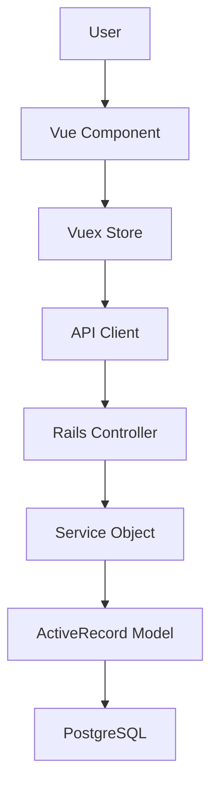
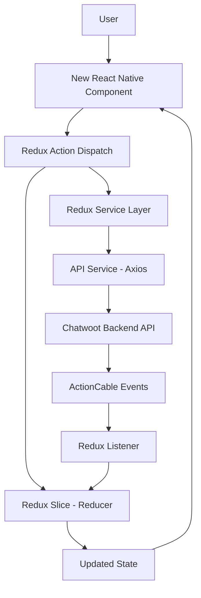

# [Feature Name] - Research Report

**IMPORTANT**: This document MUST be created in `/docs/ignored/design/<feature_name>_research.md`

**Session ID**: <unique_session_id>
**Created**: YYYY-MM-DD HH:MM:SS
**Research Agent**: Claude Code (Anthropic)
**Status**: Draft | Under Review | Approved
**Related Request**: <brief description of user request>
**Project**: Chatwoot Mobile App (React Native + Expo + TypeScript)

> **Note on Diagrams**: When including diagrams in this research report, use simple mermaid snippets to visualize architecture, flows, dependencies, and relationships. Keep diagrams minimal and focused on key concepts.

---

## Original Request

### User Request

> [Exact user request or summary]

### Request Date

YYYY-MM-DD HH:MM:SS

### Request Context

[Any additional context about why this request was made]

---

## Request Understanding

### Core Objective

[What the user wants to achieve - 2-3 sentences]

---

### Clarifications & Assumptions

#### Questions Asked

1. **Q**: [Question 1]
   **A**: [Answer 1]

2. **Q**: [Question 2]
   **A**: [Answer 2]

3. **Q**: [Question 3]
   **A**: [Answer 3]

#### Assumptions Made

1. [Assumption 1] - [Rationale]
2. [Assumption 2] - [Rationale]
3. [Assumption 3] - [Rationale]

---

### Success Criteria

- [ ] Criterion 1: [Description]
- [ ] Criterion 2: [Description]
- [ ] Criterion 3: [Description]
- [ ] Criterion 4: [Description]

---

## Repository Analysis

### Current Architecture

#### Files Analyzed

**Backend - Models** (X files):
- `app/models/model1.rb:line_number` - [Current purpose and key functionality]
- `app/models/model2.rb:line_number` - [Current purpose and key functionality]
- `app/models/concerns/concern1.rb:line_number` - [Shared behavior]

**Backend - Services** (X files):
- `app/services/domain/action_service.rb:line_number` - [Business logic]
- `app/services/domain/update_service.rb:line_number` - [Update logic]

**Backend - Controllers** (X files):
- `app/controllers/api/v1/accounts/resource_controller.rb:line_number` - [API endpoints]
- `app/controllers/public/resource_controller.rb:line_number` - [Public endpoints]

**Backend - Jobs** (X files):
- `app/jobs/domain/action_job.rb:line_number` - [Background processing]

**Backend - Listeners** (X files):
- `app/listeners/resource_listener.rb:line_number` - [Event handling]

**Backend - Builders/Finders** (X files):
- `app/builders/messages/message_builder.rb:line_number` - [Object construction]
- `app/finders/conversations_finder.rb:line_number` - [Complex queries]

**Backend - Views (Jbuilder)** (X files):
- `app/views/api/v1/accounts/resources/show.json.jbuilder:line_number` - [JSON responses]

**Frontend - Components** (X files):
- `app/javascript/dashboard/components/ComponentName.vue:line_number` - [UI component]

**Frontend - Store** (X files):
- `app/javascript/dashboard/store/modules/stores.js:line_number` - [State management]

**Frontend - i18n** (X files):
- `app/javascript/dashboard/i18n/locale/en.json` - [English translations]
- `app/javascript/dashboard/i18n/locale/es.json` - [Spanish translations]

**Database**:
- `db/migrate/YYYYMMDDHHMMSS_migration_name.rb` - [Schema changes]
- `db/schema.rb` - [Current schema]

**Tests - Backend** (X files):
- `spec/models/model_spec.rb:line_number` - [Model tests]
- `spec/services/service_spec.rb:line_number` - [Service tests]
- `spec/requests/api_spec.rb:line_number` - [Request specs]

**Tests - Frontend** (X files):
- `app/javascript/dashboard/components/__tests__/ComponentName.spec.js` - [Component tests]

**Enterprise** (X files):
- `enterprise/app/models/model.rb` - [Enterprise extensions]
- `enterprise/app/services/service.rb` - [Enterprise overrides]

**Total Files Analyzed**: XX files

---

### Current Implementation Patterns

#### Backend Patterns

**Service Objects**:
```ruby
# app/services/stores/create_service.rb:15
class Stores::CreateService
  def initialize(account:, params:)
    @account = account
    @params = params
  end

  def perform
    store = @account.stores.build(store_params)
    store.save!
    dispatch_event(store)
    store
  end

  private

  def store_params
    @params.permit(:name, :phone_number)
  end

  def dispatch_event(store)
    Rails.configuration.dispatcher.dispatch(
      STORE_CREATED,
      Time.zone.now,
      store: store
    )
  end
end
```

**Event Dispatchers**:
```ruby
# app/listeners/store_listener.rb:5
class StoreListener < BaseListener
  def store_created(event)
    store = event.data[:store]
    # Trigger notifications, analytics, etc.
  end
end
```

**Finder Objects**:
```ruby
# app/finders/stores_finder.rb:10
class StoresFinder
  def initialize(account, params)
    @account = account
    @params = params
  end

  def perform
    stores = @account.stores
    stores = filter_by_status(stores) if @params[:status]
    stores
  end
end
```

#### Frontend Patterns

**Vue Components (Composition API)**:
```vue
<!-- app/javascript/dashboard/components/StoreDetails.vue:5 -->
<script setup>
import { ref, computed } from 'vue';
import { useStore } from 'vuex';

const store = useStore();
const storeData = computed(() => store.getters['stores/getCurrentStore']);
</script>

<template>
  <div class="flex flex-col gap-4">
    <!-- Tailwind CSS only -->
  </div>
</template>
```

**Vuex State Management**:
```javascript
// app/javascript/dashboard/store/modules/stores.js:20
export default {
  namespaced: true,
  state: { records: [] },
  getters: { getStores: (state) => state.records },
  actions: {
    async fetchStores({ commit }) {
      const response = await StoresAPI.getAll();
      commit('setStores', response.data.payload);
    }
  },
  mutations: {
    setStores(state, stores) {
      state.records = stores;
    }
  }
};
```

---

### Dependencies & Relationships

**Key Dependencies**:
- Model 1 → Model 2 (association: `has_many`, `belongs_to`)
- Service 1 → Repository (database access via ActiveRecord)
- Controller → Service (business logic delegation)
- Component → Vuex Store → API Client → Backend

**Data Flow**:
```
User Action (Vue Component)
  ↓
Vuex Action (API Call)
  ↓
Rails Controller (HTTP)
  ↓
Service Object (Business Logic)
  ↓
Model (ActiveRecord)
  ↓
PostgreSQL Database
```

**Event Flow** (if event-driven):
```
Service Object
  ↓
Event Dispatcher
  ↓
Listeners (StoreListener, NotificationListener, etc.)
  ↓
Background Jobs (Sidekiq)
```

---

### Current Limitations

1. **Limitation 1**: [Description]
   - **Impact**: [How it affects users/system]
   - **Evidence**: [File reference or code example]

2. **Limitation 2**: [Description]
   - **Impact**: [How it affects users/system]
   - **Evidence**: [File reference or code example]

3. **Limitation 3**: [Description]
   - **Impact**: [How it affects users/system]
   - **Evidence**: [File reference or code example]

---

## Alternative Approaches

### Approach 1: [Name]

**Description**: [High-level description]

**Changes Required**:
- **Backend**: Models, Services, Controllers, Jobs
- **Frontend**: Components, Vuex Store, i18n
- **Database**: Migrations, indexes
- **Tests**: RSpec + Vitest specs

**Pros**:
- Pro 1: [Description]
- Pro 2: [Description]
- Pro 3: [Description]

**Cons**:
- Con 1: [Description]
- Con 2: [Description]
- Con 3: [Description]

**Effort Estimate**: X days

**Risk Level**: Low | Medium | High

---

### Approach 2: [Name]

**Description**: [High-level description]

**Changes Required**:
- **Backend**: [Specific components]
- **Frontend**: [Specific components]
- **Database**: [Schema changes]
- **Tests**: [Test requirements]

**Pros**:
- Pro 1: [Description]
- Pro 2: [Description]

**Cons**:
- Con 1: [Description]
- Con 2: [Description]

**Effort Estimate**: Y days

**Risk Level**: Low | Medium | High

---

### Approach 3: [Name] (if applicable)

[Repeat structure from Approach 1]

---

## Recommendation

### Recommended Approach

**Choice**: Approach [X] - [Name]

**Rationale**:
1. [Reason 1]
2. [Reason 2]
3. [Reason 3]

**Trade-offs Accepted**:
- Trade-off 1: [Description and why it's acceptable]
- Trade-off 2: [Description and why it's acceptable]

---

## Implementation Scope

### Files to Create

**Backend**:
- [ ] `app/models/new_model.rb` - [Purpose]
- [ ] `app/services/domain/new_service.rb` - [Purpose]
- [ ] `app/jobs/domain/new_job.rb` - [Purpose]
- [ ] `db/migrate/YYYYMMDDHHMMSS_migration_name.rb` - [Schema change]

**Frontend**:
- [ ] `app/javascript/dashboard/components/NewComponent.vue` - [Purpose]
- [ ] `app/javascript/dashboard/store/modules/new_module.js` - [Purpose]
- [ ] `app/javascript/dashboard/api/new_api.js` - [Purpose]

**Tests**:
- [ ] `spec/models/new_model_spec.rb` - [Coverage]
- [ ] `spec/services/new_service_spec.rb` - [Coverage]
- [ ] `app/javascript/dashboard/components/__tests__/NewComponent.spec.js` - [Coverage]

---

### Files to Modify

**Backend**:
- [ ] `app/models/existing_model.rb:line_number` - [Change description]
- [ ] `app/services/domain/existing_service.rb:line_number` - [Change description]
- [ ] `app/controllers/api/v1/accounts/resource_controller.rb:line_number` - [Change description]

**Frontend**:
- [ ] `app/javascript/dashboard/components/ExistingComponent.vue:line_number` - [Change description]
- [ ] `app/javascript/dashboard/store/modules/existing.js:line_number` - [Change description]
- [ ] `app/javascript/dashboard/i18n/locale/en.json` - [Add translations]
- [ ] `app/javascript/dashboard/i18n/locale/es.json` - [Add translations]

**Database**:
- [ ] `db/migrate/` - Create new migration for [schema change]

**Tests**:
- [ ] `spec/models/existing_model_spec.rb` - [Update tests]
- [ ] `spec/requests/api/v1/accounts/resources_spec.rb` - [Add request specs]

**Enterprise** (if applicable):
- [ ] `enterprise/app/models/model.rb` - [Enterprise compatibility]

**Total Files**: XX to create, YY to modify

---

### Files to Delete

- [ ] `path/to/deprecated_file.rb` - [Reason for deletion]
- [ ] `path/to/old_file.vue` - [Replaced by new implementation]

---

## Testing Strategy

### Backend Testing

**Test Types**:
- [ ] Model specs (`spec/models/`)
- [ ] Service specs (`spec/services/`)
- [ ] Controller specs (`spec/controllers/`)
- [ ] Request specs (`spec/requests/`) - API integration tests
- [ ] Job specs (`spec/jobs/`)

**Coverage Goal**: ≥80% for changed files

**Key Test Scenarios**:
1. Happy path: [Description]
2. Validation errors: [Description]
3. Edge cases: [Description]
4. Error scenarios: [Description]

---

### Frontend Testing

**Test Types**:
- [ ] Component tests (Vitest)
- [ ] Vuex store tests (Vitest)
- [ ] Integration tests (user flows)

**Coverage Goal**: ≥80% for changed files

**Key Test Scenarios**:
1. Component rendering: [Description]
2. User interactions: [Description]
3. State management: [Description]
4. API integration: [Description]

---

## Risk Assessment

### Technical Risks

**Risk 1**: [Description]
- **Probability**: Low | Medium | High
- **Impact**: Low | Medium | High
- **Mitigation**: [Strategy]

**Risk 2**: [Description]
- **Probability**: Low | Medium | High
- **Impact**: Low | Medium | High
- **Mitigation**: [Strategy]

**Risk 3**: [Description]
- **Probability**: Low | Medium | High
- **Impact**: Low | Medium | High
- **Mitigation**: [Strategy]

---

### Business Risks

**Risk 1**: [Description]
- **Probability**: Low | Medium | High
- **Impact**: Low | Medium | High
- **Mitigation**: [Strategy]

---

## Open Questions

1. **Question 1**: [Unresolved technical or business question]
   - **Impact**: [Why this needs to be answered]
   - **Recommendation**: [Suggested approach to resolve]

2. **Question 2**: [Description]
   - **Impact**: [Why this matters]
   - **Recommendation**: [Suggested resolution]

---

## Next Steps

### Immediate Actions

1. [ ] Get stakeholder approval on recommended approach
2. [ ] Create detailed design document
3. [ ] Set up feature branch: `feature/feature-name`
4. [ ] Create tracking document from DEVELOPMENT_EXECUTION_TEMPLATE.md

### Estimated Timeline

| Phase | Duration | Owner |
|-------|----------|-------|
| Design Document | X hours | Developer |
| Backend Implementation | Y days | Developer |
| Frontend Implementation | Z days | Developer |
| Testing | W days | Developer + QA |
| Code Review | 1 day | Team |
| **Total** | **N days** | |

---

## Appendix

### Related Documentation

- **Architecture**: [docs/ARCHITECTURE.md](../../ARCHITECTURE.md)
- **Development Guidelines**: [CLAUDE.md](../../CLAUDE.md)
- **Design Process**: [research_and_design_process.md](./research_and_design_process.md)

### External References

- [Relevant Rails guides or Vue.js docs]
- [Similar features in other systems]
- [Slack/GitHub discussions]

### Diagrams

**Current Architecture**:


**Proposed Architecture**:


---

**Last Updated**: YYYY-MM-DD HH:MM:SS
**Updated By**: Claude Code (Anthropic)
